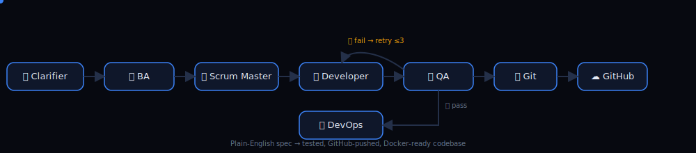

<div align="center">


<a href="https://www.linkedin.com/in/sakshi-selmokar-45802a241/"></a>
<a href="https://sakshi-selmokar.netlify.app"></a>
<a href="mailto:selmokarsakshi0@gmail.com"></a>

<br/>

<a href="https://github.com/sakshiselmokar">

</a>

</div>

<br/>


### ⚡ Currently Building

```python
class Sakshi:
    def __init__(self):
        self.role        = "AI/ML Engineer @ Sutherland Global"
        self.building    = "Agentic SDLC Platform — 8-agent LangGraph pipeline"
        self.focus       = ["RAG", "Multi-Agent Systems", "Forecasting", "Voice AI"]
        self.fun_fact    = "Promoted Intern → Engineer in 11 months 🚀"

    def currently_debugging(self):
        return "routing logic between Dev ↔ QA agents 🔁"
```

<br/>


### 🤖 Featured Build — Agentic SDLC Platform

<div align="center">



*Plain-English spec in → tested, GitHub-pushed, Docker-ready codebase out. Self-healing Dev↔QA loop with up to 3 auto-retries.*

`LangGraph` `FastAPI` `OpenRouter` `pytest` `Docker` `Railway` `SSE Streaming`

</div>

<br/>


### 🚀 Project Showcase

<table align="center">
<tr>
<td width="50%">

<h4>📚 StudyGenie</h4>
  

Local-first AI learning companion. Whisper STT → Ollama → Piper TTS, with RAG-based summarization and quiz generation. Zero cloud dependency.

<a href="https://github.com/sakshiselmokar/StudyGenie-AI-Learning-Companion">↗ View Repo</a>

</td>
<td width="50%">

<h4>🔬 DermAI</h4>
  

On-device skin condition classifier — TFLite ResNet-50 inside a Flutter Android app, with Firebase Auth and Maps integration.

<a href="https://github.com/sakshiselmokar/DermAI-Skin-Disease-Diagnosis">↗ View Repo</a>

</td>
</tr>
<tr>
<td width="50%">

<h4>✋ AirFlow AI</h4>
 

Draw flowcharts mid-air with hand gestures. MediaPipe tracking → EMNIST text recognition → live code generation.

</td>
<td width="50%">

<h4>⚡ Smart Assist <sub>(Sutherland)</sub></h4>
 

Enterprise RAG assistant for a Workforce Optimization Platform. Claude + semantic search → 60% faster information retrieval.

</td>
</tr>
</table>

<br/>


### 🛠️ Tech Stack

<p align="center">

</p>

<p align="center">


</p>

<br/>


### 🏆 Milestones

<div align="center">

| | |
|---|---|
| 🥇 | CSE Gold Medalist — CGPA 9.45 |
| 🏆 | Smart India Hackathon 2023 — **National Winner** (16 finalist teams) |
| ⚡ | ATMECS GenAI Hackathon — **Top 12 / 4000+** participants |
| 🚀 | Intern → AI/ML Engineer in **11 months** |

</div>

<br/>

### 🔥 Contribution Activity

<div align="center">

</div>

<br/>


<div align="center">

📫 <a href="mailto:selmokarsakshi0@gmail.com">selmokarsakshi0@gmail.com</a> &nbsp;·&nbsp; 🌐 <a href="https://sakshi-selmokar.netlify.app">sakshi-selmokar.netlify.app</a>


</div>
